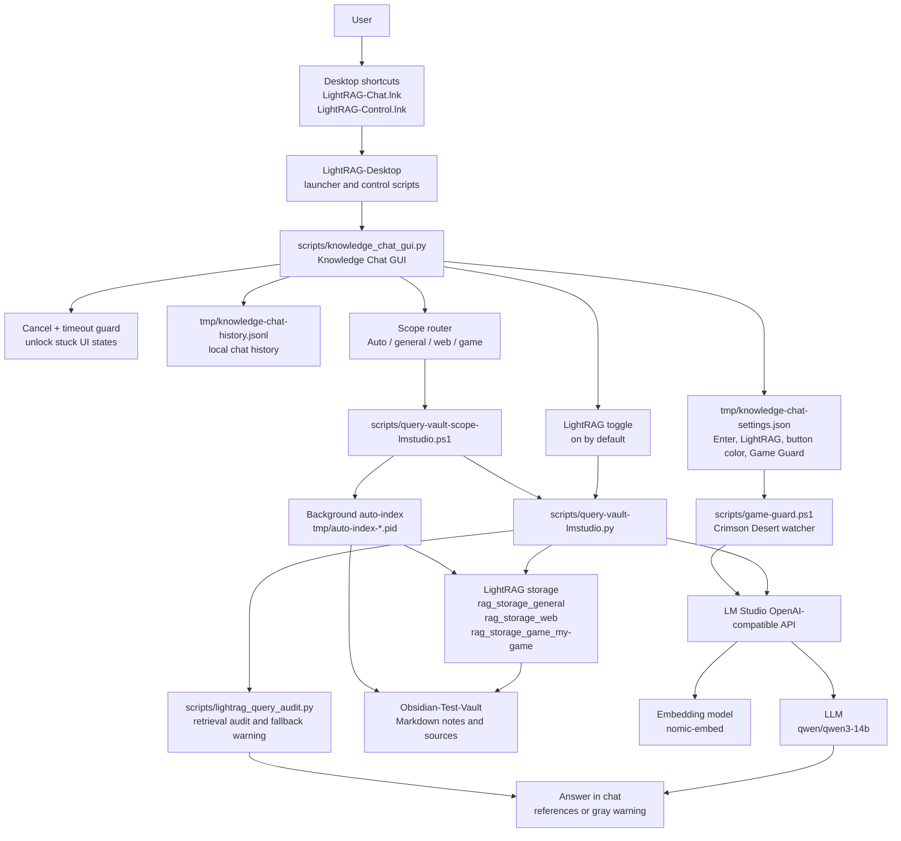
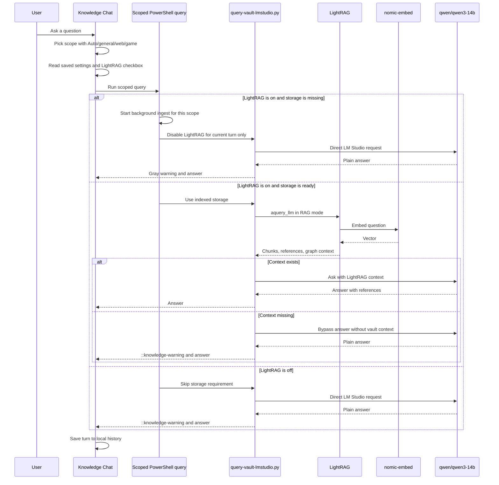

# KnowledgeLab Architecture

State date: 2026-06-06.

KnowledgeLab is a local-first Windows knowledge system built from an Obsidian Markdown vault, LightRAG retrieval, and LM Studio local models.

## Goals

- Keep knowledge in plain Markdown.
- Index selected vault scopes with LightRAG.
- Retrieve relevant chunks before the LLM answer.
- Show a visible gray warning when an answer was generated without knowledge-base context.
- Keep chat usable when an index is missing by auto-indexing in the background and answering through fallback mode for that turn.
- Protect the UI from stuck states with cancellation and timeouts.
- Protect games from local AI model memory pressure with a background Game Guard.
- Keep the Desktop clean with only two launchers.
- Keep runtime files, indexes, history, and secrets local.

## Main Paths

```text
Project root:
C:\MyFiles\KnowledgeLab

Obsidian vault:
C:\MyFiles\KnowledgeLab\Obsidian-Test-Vault

LightRAG virtual environment:
C:\MyFiles\KnowledgeLab\LightRAG\.venv

Desktop launchers:
%USERPROFILE%\Desktop\LightRag\LightRAG-Chat.lnk
%USERPROFILE%\Desktop\LightRag\LightRAG-Control.lnk

Desktop launcher logic:
C:\MyFiles\KnowledgeLab\LightRAG-Desktop

Shortcut icons:
C:\MyFiles\KnowledgeLab\assets\icons\LightRAG-Chat.ico
C:\MyFiles\KnowledgeLab\assets\icons\LightRAG-Control.ico

Local chat history:
C:\MyFiles\KnowledgeLab\tmp\knowledge-chat-history.jsonl

Local chat settings:
C:\MyFiles\KnowledgeLab\tmp\knowledge-chat-settings.json

LM Studio API:
http://127.0.0.1:1234/v1
```

## Runtime Architecture



## Query Flow



## Components

| Component | Role | Important files |
| --- | --- | --- |
| Obsidian vault | Source of truth for Markdown knowledge | `Obsidian-Test-Vault` |
| Source import | Places links, Telegram exports, articles, and notes into the vault | `scripts/*telegram*`, `scripts/*youtube*`, `scripts/vault_sources.py` |
| LightRAG ingest | Builds vector and graph storage for a selected scope | `scripts/ingest-vault-lmstudio.py`, `scripts/ingest-vault-scope-lmstudio.ps1` |
| LightRAG query | Retrieves chunks and calls the local LLM | `scripts/query-vault-lmstudio.py`, `scripts/query-vault-scope-lmstudio.ps1` |
| Query audit | Reads structured retrieval results and formats warnings | `scripts/lightrag_query_audit.py` |
| Knowledge Chat | Desktop GUI for questions, captures, history, settings, cancellation, and fallback warnings | `scripts/knowledge_chat_gui.py` |
| Chat settings | Persisted preferences for Enter-to-send, LightRAG, button color, and Game Guard | `tmp/knowledge-chat-settings.json` |
| Game Guard | Watches selected game processes and unloads local AI models before they compete for RAM/VRAM | `scripts/game-guard.ps1` |
| Desktop Control | Maintenance launcher for checks, manual indexing, vault opening, model stop, and Game Guard | `LightRAG-Desktop/LightRAG-Control` |
| Installer | Sets up dependencies and writes the two Desktop launchers | `scripts/install-knowledge-lab.ps1`, `scripts/install_wizard_gui.py` |

## Knowledge Scopes

| Scope | Project | Storage | Purpose |
| --- | --- | --- | --- |
| `general` | empty | `LightRAG/rag_storage_general` | General notes, Unity resources, articles, music, Telegram and YouTube sources |
| `web` | `web-development` | `LightRAG/rag_storage_web` | Web-development notes, snippets, frontend/backend solutions and sources |
| `game` | `my-game` | `LightRAG/rag_storage_game_my-game` | Personal game-project knowledge |

Example frontmatter:

```yaml
scope: game
project: my-game
```

## Ingest Flow


Regular chat usage starts missing indexing automatically. These commands are manual maintenance tools:

```powershell
scripts\ingest-vault-scope-lmstudio.ps1 -Scope general
scripts\ingest-vault-scope-lmstudio.ps1 -Scope web -Project web-development
scripts\ingest-vault-scope-lmstudio.ps1 -Scope game -Project my-game
```

## Answer Behavior

The normal path is retrieval-first:

1. The GUI selects a scope.
2. The GUI reads saved settings for Enter-to-send, LightRAG, button color, and Game Guard.
3. The PowerShell wrapper points `LMSTUDIO_RAG_DIR` at that scope storage.
4. If storage is missing, the wrapper starts background indexing and forces plain LM Studio mode for that one answer.
5. If storage is ready, `query-vault-lmstudio.py` calls `LightRAG.aquery_llm(...)`.
6. LightRAG embeds the question, retrieves chunks, and prepares context.
7. The LLM answers with retrieved context.
8. The query layer checks chunks, references, entities, and relationships.
9. If the context is missing, the answer still completes through bypass mode and the GUI shows a gray warning.

When the `LightRAG` checkbox is off, the GUI sets:

```powershell
$env:LMSTUDIO_USE_LIGHTRAG='0'
```

That mode skips LightRAG storage checks and sends the question directly to LM Studio. The GUI still shows a gray warning so the user can see that the knowledge base was not used.

Chat requests run with a timeout and a visible `Cancel` button. If a child process hangs, the GUI terminates it and unlocks the buttons.

Game Guard state is stored in `tmp/knowledge-chat-settings.json`. When it is enabled, the chat installs a Windows Startup watcher and starts it in the background. When it is disabled, the watcher is stopped and removed from Startup.

## Diagnostics

`LMSTUDIO_SHOW_RETRIEVAL` does not enable LightRAG. It only prints an audit report. LightRAG is enabled by default unless `LMSTUDIO_USE_LIGHTRAG=0` is set.

```powershell
$env:LMSTUDIO_SHOW_RETRIEVAL='1'
scripts\query-vault-scope-lmstudio.ps1 -Scope game -Project my-game "What is known about my-game? Give references."
```

Healthy audit:

```text
LightRAG retrieval audit:
- status: success
- mode: naive
- chunks found: 1
- final chunks sent to answer: 1
- references: 1
- source files:
  [1] 20 Projects/My Game/_README.md
```

Control smoke test:

```powershell
powershell -NoProfile -ExecutionPolicy Bypass -File "C:\MyFiles\KnowledgeLab\LightRAG-Desktop\LightRAG-Control\LightRAG-Control.ps1" -SmokeTest
```

Expected:

```text
ScriptCount=9
CmdCount=9
```

## Installer Layout

The stable installer writes only these shortcuts to the Desktop:

```text
LightRAG-Chat.lnk
LightRAG-Control.lnk
```

Everything else stays under:

```text
C:\MyFiles\KnowledgeLab\LightRAG-Desktop
```

Shortcut icons live under:

```text
C:\MyFiles\KnowledgeLab\assets\icons
```

The installer also writes `INSTALL_REPORT.md` and shows a final manual-steps section for tools that still need to be installed by hand.

## Local-Only Artifacts

These are intentionally not committed:

- `LightRAG/.venv`
- `LightRAG/rag_storage*`
- `tmp/knowledge-chat-history.jsonl`
- `tmp/knowledge-chat-settings.json`
- `.env`
- downloaded models and archives
- generated installer reports
