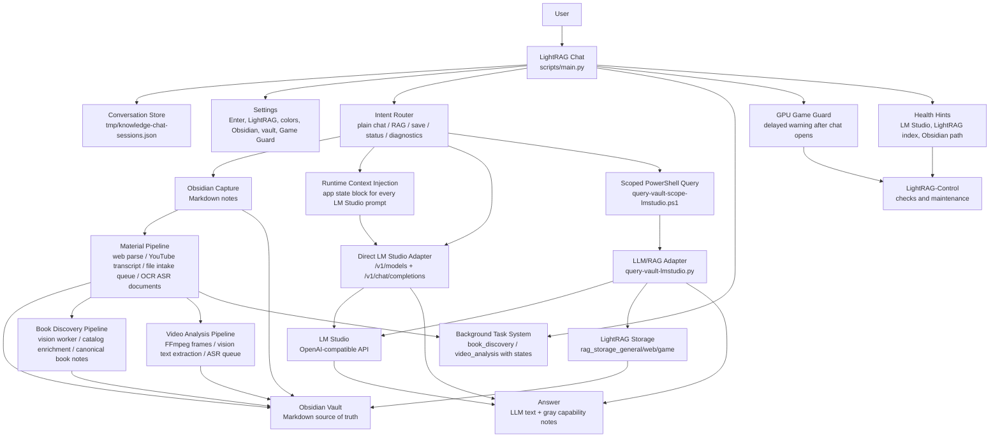
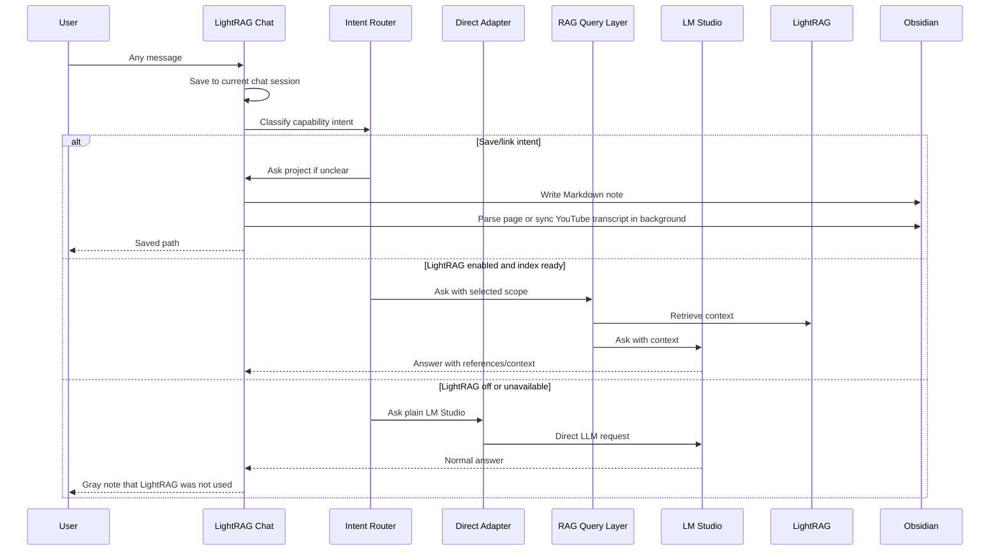

# KnowledgeLab Architecture

State date: 2026-06-23.

KnowledgeLab is a local-first Windows knowledge system. The chat is an ordinary LM Studio chat by default, with optional LightRAG retrieval, Obsidian capture, diagnostics, and GPU conflict warnings as capabilities around the conversation.

## Goals

- Keep normal chat unrestricted: greetings, short messages, code requests, translation, brainstorming, and questions all go to the LLM.
- Keep LightRAG optional and visible: when it is off or unavailable, the answer still completes and the UI shows a small gray note.
- Keep knowledge in plain Markdown inside an Obsidian vault.
- Keep permanent storage lightweight: source files are temporary inputs; extracted text, transcripts, metadata, and references are the durable artifacts.
- Keep chat history, settings, indexes, logs, and secrets local.
- Make failures understandable and point the user to LightRAG-Control when the system needs maintenance.
- Warn about likely GPU conflicts without auto-closing games or auto-starting Game Guard at Windows startup.
- Keep the Desktop clean with only `LightRAG-Chat.lnk` and `LightRAG-Control.lnk`.

## Main Paths

```text
Project root:
C:\MyFiles\KnowledgeLab

Obsidian vault:
C:\MyFiles\KnowledgeLab\Obsidian-Test-Vault

Desktop launchers:
%USERPROFILE%\Desktop\LightRag\LightRAG-Chat.lnk
%USERPROFILE%\Desktop\LightRag\LightRAG-Control.lnk

Chat sessions:
C:\MyFiles\KnowledgeLab\tmp\knowledge-chat-sessions.json

Chat settings:
C:\MyFiles\KnowledgeLab\tmp\knowledge-chat-settings.json

Material queue:
C:\MyFiles\KnowledgeLab\tmp\material-processing-queue.jsonl

LM Studio API:
http://127.0.0.1:1234/v1
```

## Runtime Architecture



## Chat Flow



## Components

| Component | Role |
| --- | --- |
| Chat UI | Messenger-style Tkinter app with left chat history, row-level rename/delete, settings, full-icon Obsidian button, muted-blue icon states for composer tools, native Windows file drop, cancel and timeout protection |
| Conversation Store | Local JSON sessions with messages, warnings, timestamps, and current chat |
| Intent Router | Treats all input as normal chat first, then activates save/RAG/diagnostic capabilities when appropriate |
| Runtime Context Snapshot | Injects current app state into each GUI prompt: active root, vault, LM Studio models, selected route, LightRAG index readiness, DnD backend, queues, background book/video tasks, and project server state |
| Direct LM Studio Adapter | Checks `/v1/models`, validates loaded model IDs, and sends plain chat directly to `/v1/chat/completions` |
| LightRAG Adapter | Uses indexed storage only when LightRAG is enabled in Settings and storage exists |
| Obsidian Capture | Saves URLs, notes, and attached files from chat into lightweight Markdown notes |
| Material Pipeline | Parses web pages into Markdown, syncs YouTube transcripts, extracts lightweight text/DOCX/folder samples, queues images/PDF/audio/video/folder/GitHub/generic sources in `tmp/material-processing-queue.jsonl`, and provides the extension point for OCR, ASR, document cleanup, repository import, folder ingestion, and reindexing |
| Health Hints | Converts system failures into readable guidance and suggests LightRAG-Control |
| GPU Game Guard | Samples GPU load after chat opens; warns about heavy processes and KnowledgeLab-side processes |
| LightRAG-Control | Manual checks, maintenance indexing, model stop, imports, and deeper troubleshooting |
| Book Discovery Pipeline | Background LM Studio vision worker detects books from photos, enriches through Open Library + Google Books, creates canonical book notes under 50 Library |
| Video Analysis Pipeline | FFmpeg frame sampling, local vision model for screen text, YouTube caption sync, ASR queue |
| Runtime Context Injection | Generates app state block injected into every LM Studio prompt (active root, vault, models, route, LightRAG readiness, DnD backend, queues, background tasks) |
| Background Task System | Tracked background tasks (book_discovery, video_analysis) with running/done/failed states |
| Installer | Checks dependencies, writes only two Desktop launchers, assigns icons, and produces `INSTALL_REPORT.md` |

## Package Structure

The Python code lives under `scripts/knowledgelab/` as a proper package (43 .py files, 9 subpackages):

```
scripts/
├── main.py                          # Entry point + KnowledgeChatApp (3,225 lines)
├── knowledgelab/
│   ├── config.py                    # Constants, paths, settings, env vars
│   ├── models.py                    # Dataclasses (KnowledgeRoute, ProjectGuess, etc.)
│   ├── utils/
│   │   ├── text.py                  # slugify, clean_filename, yaml_quote, file text extraction
│   │   ├── urls.py                  # URL patterns, parsing, normalization
│   │   ├── colors.py                # Hex color manipulation
│   │   └── paths.py                 # Path normalization, DnD detection
│   ├── routing/
│   │   ├── intent.py                # Scope routing, save/lookup/help detection
│   │   ├── topics.py                # Topic registry, auto-route, auto-create
│   │   └── project_stack.py         # npm/pnpm/yarn detection
│   ├── vault/
│   │   ├── frontmatter.py           # Frontmatter parsing, scope/layer inference
│   │   ├── capture.py               # File capture, markdown rendering, project_title_from_source_hint
│   │   └── capture_workflow.py      # File capture and attachment workflow
│   ├── material/
│   │   ├── web.py                   # Article extraction, SPA bundle, HTML parsers, folder scanning
│   │   ├── codepen.py               # CodePen snapshot extraction
│   │   ├── github.py                # GitHub metadata
│   │   ├── queue.py                 # JSONL queue management + queue_file/github/rlm_item
│   │   ├── youtube.py               # YouTube sync command building
│   │   ├── video.py                 # Video analysis, frame parsing, report formatting
│   │   └── workers.py               # Background material processing workers
│   ├── vision/
│   │   ├── book_discovery.py        # Book detection, catalog enrichment
│   │   └── html_parsers.py          # Re-export from material.web
│   ├── llm/
│   │   ├── lmstudio.py              # LM Studio API client, model checks
│   │   ├── runtime_context.py       # Runtime context prompt generation
│   │   ├── diagnostics.py           # System diagnostics
│   │   ├── web_search.py            # DuckDuckGo search
│   │   ├── voice.py                 # Voice input script building
│   │   └── game_guard.py            # GPU snapshot collection, heavy-load detection
│   ├── ui/
│   │   ├── widgets.py               # InteractiveButton ABC + 4 subclasses
│   │   ├── theme.py                 # UI_THEME, BUTTON_COLOR_PRESETS
│   │   ├── tooltip.py               # ToolTip class
│   │   ├── chat_store.py            # Chat session persistence and CRUD
│   │   ├── settings.py              # Settings persistence, normalization, color presets
│   │   ├── settings_dialog.py       # Settings dialog UI
│   │   ├── game_guard_dialog.py     # GPU conflict warning dialog
│   │   ├── project_panel.py         # Project action panel UI and workers
│   │   └── chat_list.py             # Chat list sidebar management (not yet integrated)
│   ├── tasks/
│   │   ├── background.py            # BackgroundTaskManager
│   │   └── project_actions.py       # Project actions CRUD, runtime workspace, command execution
│   └── tests/
│       └── self_test.py             # Self-test (stub)
├── lmstudio_common.py               # Shared LM Studio config (uses knowledgelab.config)
├── vault_sources.py                 # Vault document collector (uses knowledgelab.utils.text)
└── [other scripts...]               # All use shared ROOT from knowledgelab.config
```
scripts/
├── main.py                          # Entry point + KnowledgeChatApp (3,495 lines)
├── knowledgelab/
│   ├── config.py                    # Constants, paths, settings, env vars
│   ├── models.py                    # Dataclasses (KnowledgeRoute, ProjectGuess, etc.)
│   ├── utils/
│   │   ├── text.py                  # slugify, clean_filename, yaml_quote
│   │   ├── urls.py                  # URL patterns, parsing, normalization
│   │   ├── colors.py                # Hex color manipulation
│   │   └── paths.py                 # Path normalization, DnD detection
│   ├── routing/
│   │   ├── intent.py                # Scope routing, save/lookup/help detection
│   │   ├── topics.py                # Topic registry, auto-route, auto-create
│   │   └── project_stack.py         # npm/pnpm/yarn detection
│   ├── vault/
│   │   ├── frontmatter.py           # Frontmatter parsing, scope/layer inference
│   │   ├── capture.py               # File capture, markdown rendering, project_title_from_source_hint
│   │   └── capture_workflow.py      # File capture and attachment workflow
│   ├── material/
│   │   ├── web.py                   # Article extraction, SPA bundle, HTML parsers
│   │   ├── codepen.py               # CodePen snapshot extraction
│   │   ├── github.py                # GitHub metadata
│   │   ├── queue.py                 # JSONL queue management + queue_file/github/rlm_item
│   │   ├── youtube.py               # YouTube sync command building
│   │   ├── video.py                 # Video analysis, frame parsing, report formatting
│   │   └── workers.py               # Background material processing workers
│   ├── vision/
│   │   ├── book_discovery.py        # Book detection, catalog enrichment
│   │   └── html_parsers.py          # Re-export from material.web
│   ├── llm/
│   │   ├── lmstudio.py              # LM Studio API client, model checks
│   │   ├── runtime_context.py       # Runtime context prompt generation
│   │   ├── diagnostics.py           # System diagnostics
│   │   ├── web_search.py            # DuckDuckGo search
│   │   ├── voice.py                 # Voice input script building
│   │   └── game_guard.py            # GPU snapshot collection, heavy-load detection
│   ├── ui/
│   │   ├── widgets.py               # InteractiveButton ABC + 4 subclasses
│   │   ├── theme.py                 # UI_THEME, BUTTON_COLOR_PRESETS
│   │   ├── tooltip.py               # ToolTip class
│   │   ├── chat_store.py            # Chat session persistence and CRUD
│   │   ├── settings.py              # Settings persistence, normalization, color presets
│   │   ├── settings_dialog.py       # Settings dialog UI
│   │   ├── game_guard_dialog.py     # GPU conflict warning dialog
│   │   ├── project_panel.py         # Project action panel UI and workers
│   │   └── chat_list.py             # Chat list sidebar management (not yet integrated)
│   ├── tasks/
│   │   ├── background.py            # BackgroundTaskManager
│   │   └── project_actions.py       # Project actions CRUD, runtime workspace, command execution
│   └── tests/
│       └── self_test.py             # Self-test (stub)
├── lmstudio_common.py               # Shared LM Studio config (uses knowledgelab.config)
├── vault_sources.py                 # Vault document collector (uses knowledgelab.utils.text)
└── lightrag_query_audit.py          # Query audit helpers
```

### Key Abstractions

- **InteractiveButton ABC** — common base for all canvas button widgets with shared hover/press/active/disabled state machine
- **Dict-based dispatch** in `capture_destination()` — replaced 140-line if-chain with lookup tables
- **Standalone functions** for LM Studio, voice, game guard, project actions, chat store, queue management

## Knowledge Scopes

| Scope | Project | Storage | Purpose |
| --- | --- | --- | --- |
| `general` | empty | `LightRAG/rag_storage_general` | General notes, Unity resources, articles, music, Telegram and YouTube sources |
| `web` | `web-development` | `LightRAG/rag_storage_web` | Web-development notes, snippets, frontend/backend solutions and sources |
| `game` | `my-game` | `LightRAG/rag_storage_game_my-game` | Personal game-project knowledge |
| `all` + `layer: finished-projects` | `project_section/project` | `LightRAG/rag_storage_finished_projects` | Completed project references isolated from active work |

## Behavior Rules

- Default chat mode is plain LM Studio. LightRAG is off until enabled in Settings.
- Explicit knowledge-base wording such as `найди в базе`, `из сохраненных материалов`, or `по материалам из Obsidian` is treated as a retrieval request.
- Finished-project wording such as `готовые проекты`, `портфолио`, `референсы`, or `похожие проекты` routes to the separate `finished-projects` layer instead of the active knowledge indexes.
- `scope` describes the subject area, `project_section` groups finished projects into subtopics, and `layer` controls retrieval isolation. Missing `layer` means `active`; `layer: finished-projects` is indexed only into `LightRAG/rag_storage_finished_projects`.
- Status questions about LightRAG, connection state, imports, queues, DnD, book discovery/resolution, video analysis, and local servers are answered from the runtime context snapshot and must not trigger retrieval by themselves.
- Plain chat does not call the PowerShell RAG wrapper; it uses the LM Studio OpenAI-compatible API directly.
- If LightRAG is enabled but the selected index is missing, LightRAG turns off, the answer uses plain LM Studio, and the user sees a gray note.
- `Enter` sends by default; `Shift+Enter` adds a newline. This is configurable.
- Big maintenance buttons stay out of the chat. Reindexing and deeper checks belong in LightRAG-Control.
- Web search is a small lower-left composer toggle: when enabled, the chat fetches search snippets and passes them into the LLM as temporary context without opening a browser for the user.
- LightRAG is local-only. It does not crawl or search the web by itself; it can use web content only after the page/video/source is saved, parsed/transcribed, and indexed into the local vault.
- Images, local folders, text files, documents, audio, video, archives, and generic files can be attached from the chat or dropped onto the chat window as Markdown intake notes. GitHub repositories and CodePen pens can be pasted as links or added through the paperclip menu. The current step stores source path or URL, topic guess, metadata, and extracted text for lightweight sources; heavier sources, full-folder ingestion, OCR, repository import, and RLM processing are queued for later processing and reindexing. The original large file or repository is not copied into the vault by default.
- Parsed pages mine useful child links into canonical reference notes and queue long/link-rich notes for Recursive Language Model processing in `tmp/rlm-processing-queue.jsonl`.
- Topic routing is automatic by default. `auto_route_topics` chooses topic/project/layer before saving, `auto_create_topics` creates `Topics/<topic>/_Topic.md` service notes, and the chat reports the routing decision after intake.
- Book photos use `book_photo`/`book_page_photo` notes under `50 Library/<book-slug>/` and stay reference-only until OCR fills `ocr_text`. Book and bookshelf images start a background LM Studio vision pass, enrich readable books through Open Library plus Google Books, create canonical `type: book` notes with candidate-source metadata, update the parent note with an `Unresolved / Not Found` list, and show a chat report grouped into added/clarify/not-found items. User-provided missing titles/authors become `book_resolution` tasks that update the parent note and create confirmed book notes by topic.
- Video sources create `video_analysis` queue items. YouTube uses caption sync plus queued frame analysis; local videos use FFmpeg-sampled frames in `tmp/video-processing/<source-id>/` and local vision extraction for code/slides/screen text, while ASR remains queued until a transcription worker is available.
- Finished projects are stored as reference-only Markdown cards under `40 Finished Projects/<section>/<project-slug>/`; original project folders and repositories stay at their source paths/URLs.
- Finished project result/server buttons are backed by `tmp/project-actions.json`. They create isolated runtime copies or Git checkouts under `tmp/project-runtime/<project-id>/` only for build/run actions, never inside the source folder or the vault.
- Voice input is a composer-side helper. It uses Windows Speech Recognition when available and inserts recognized text into the input field instead of auto-sending.
- Obsidian opens through the right-edge icon. If the app cannot be found, the user can select `Obsidian.exe` or open the Obsidian website.
- Game Guard does not run at Windows startup by default. It samples GPU load a few seconds after the chat opens and warns only on sustained load.
- The installer removes legacy Game Guard startup shortcuts left by older builds.
- Startup blocking by the old process-name Game Guard is opt-in through `KNOWLEDGELAB_STARTUP_GAME_GUARD=1`.

## Diagnostics

Manual retrieval audit:

```powershell
$env:LMSTUDIO_SHOW_RETRIEVAL='1'
scripts\query-vault-scope-lmstudio.ps1 -Scope game -Project my-game "What is known about my-game? Give references."
```

Plain LLM mode:

```powershell
$env:LMSTUDIO_USE_LIGHTRAG='0'
scripts\query-vault-scope-lmstudio.ps1 -Scope web -Project web-development "Make CSS for a popup window."
```

Control smoke test:

```powershell
powershell -NoProfile -ExecutionPolicy Bypass -File "C:\MyFiles\KnowledgeLab\LightRAG-Desktop\LightRAG-Control\LightRAG-Control.ps1" -SmokeTest
```

## Local-Only Artifacts

These are intentionally not committed:

- `LightRAG/.venv`
- `LightRAG/rag_storage*`
- `tmp/knowledge-chat-sessions.json`
- `tmp/knowledge-chat-history.jsonl`
- `tmp/knowledge-chat-settings.json`
- `tmp/material-processing-queue.jsonl`
- `tmp/rlm-processing-queue.jsonl`
- `tmp/project-actions.json`
- `tmp/project-runtime`
- `tmp/project-action-logs`
- `.env`
- downloaded models and archives
- generated installer reports
