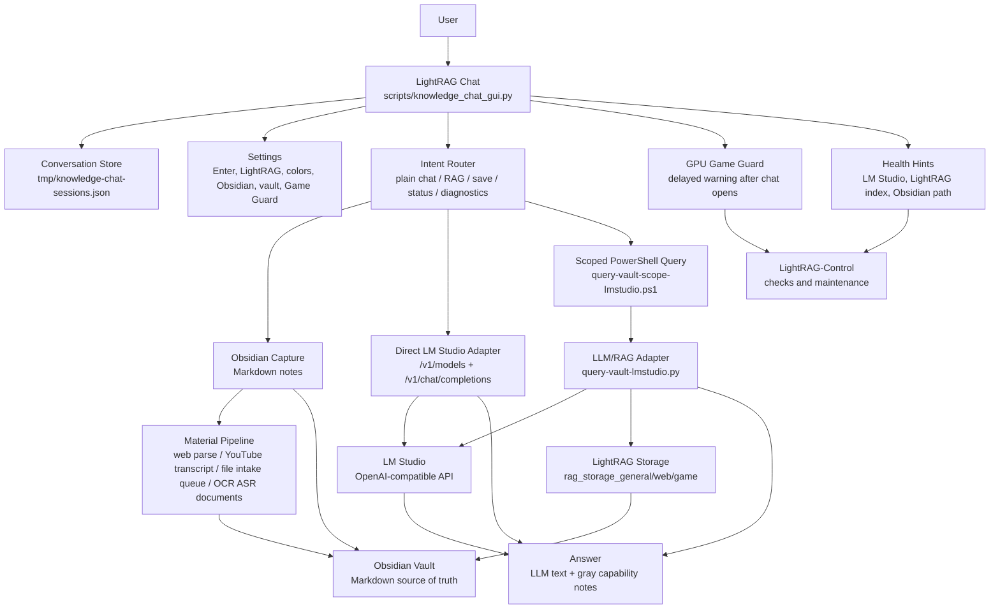
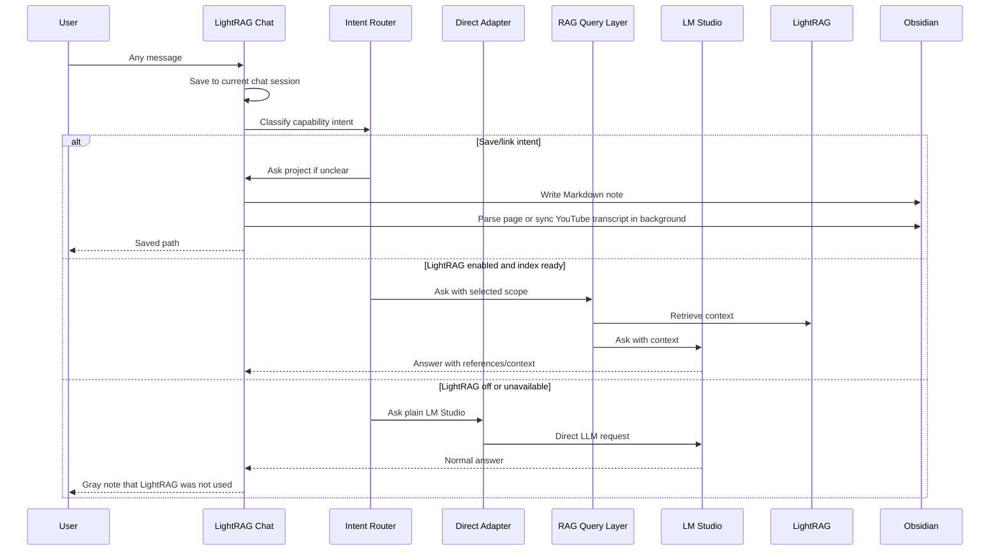

# KnowledgeLab Architecture

State date: 2026-06-13.

KnowledgeLab is a local-first Windows knowledge system. The chat is an ordinary LM Studio chat by default, with optional LightRAG retrieval, Obsidian capture, diagnostics, and GPU conflict warnings as capabilities around the conversation.

## Goals

- Keep normal chat unrestricted: greetings, short messages, code requests, translation, brainstorming, and questions all go to the LLM.
- Keep LightRAG optional and visible: when it is off or unavailable, the answer still completes and the UI shows a small gray note.
- Keep knowledge in plain Markdown inside an Obsidian vault.
- Keep permanent storage lightweight: source files are temporary inputs; extracted text, transcripts, metadata, and references are the durable artifacts.
- Keep chat history, settings, indexes, logs, and secrets local.
- Make failures understandable and point the user to LightRAG-Control when the system needs maintenance.
- Warn about likely GPU conflicts without auto-closing games or auto-starting Game Guard at Windows startup.
- Keep the Desktop clean with only `LightRAG-Chat.lnk` and `LightRAG-Control.lnk`.

## Main Paths

```text
Project root:
C:\MyFiles\KnowledgeLab

Obsidian vault:
C:\MyFiles\KnowledgeLab\Obsidian-Test-Vault

Desktop launchers:
%USERPROFILE%\Desktop\LightRag\LightRAG-Chat.lnk
%USERPROFILE%\Desktop\LightRag\LightRAG-Control.lnk

Chat sessions:
C:\MyFiles\KnowledgeLab\tmp\knowledge-chat-sessions.json

Chat settings:
C:\MyFiles\KnowledgeLab\tmp\knowledge-chat-settings.json

Material queue:
C:\MyFiles\KnowledgeLab\tmp\material-processing-queue.jsonl

LM Studio API:
http://127.0.0.1:1234/v1
```

## Runtime Architecture



## Chat Flow



## Components

| Component | Role |
| --- | --- |
| Chat UI | Messenger-style Tkinter app with left chat history, row-level rename/delete, settings, full-icon Obsidian button, muted-blue icon states for composer tools, native Windows file drop, cancel and timeout protection |
| Conversation Store | Local JSON sessions with messages, warnings, timestamps, and current chat |
| Intent Router | Treats all input as normal chat first, then activates save/RAG/diagnostic capabilities when appropriate |
| Direct LM Studio Adapter | Checks `/v1/models`, validates loaded model IDs, and sends plain chat directly to `/v1/chat/completions` |
| LightRAG Adapter | Uses indexed storage only when LightRAG is enabled in Settings and storage exists |
| Obsidian Capture | Saves URLs, notes, and attached files from chat into lightweight Markdown notes |
| Material Pipeline | Parses web pages into Markdown, syncs YouTube transcripts, extracts lightweight text/DOCX content, queues images/PDF/audio/video/generic sources in `tmp/material-processing-queue.jsonl`, and provides the extension point for OCR, ASR, document cleanup, and reindexing |
| Health Hints | Converts system failures into readable guidance and suggests LightRAG-Control |
| GPU Game Guard | Samples GPU load after chat opens; warns about heavy processes and KnowledgeLab-side processes |
| LightRAG-Control | Manual checks, maintenance indexing, model stop, imports, and deeper troubleshooting |
| Installer | Checks dependencies, writes only two Desktop launchers, assigns icons, and produces `INSTALL_REPORT.md` |

## Knowledge Scopes

| Scope | Project | Storage | Purpose |
| --- | --- | --- | --- |
| `general` | empty | `LightRAG/rag_storage_general` | General notes, Unity resources, articles, music, Telegram and YouTube sources |
| `web` | `web-development` | `LightRAG/rag_storage_web` | Web-development notes, snippets, frontend/backend solutions and sources |
| `game` | `my-game` | `LightRAG/rag_storage_game_my-game` | Personal game-project knowledge |

## Behavior Rules

- Default chat mode is plain LM Studio. LightRAG is off until enabled in Settings.
- Explicit knowledge-base wording such as `найди в базе`, `из сохраненных материалов`, or `по материалам из Obsidian` is treated as a retrieval request.
- LightRAG status wording such as `lightrag подключен?` is answered by the app status layer and must not trigger retrieval.
- Plain chat does not call the PowerShell RAG wrapper; it uses the LM Studio OpenAI-compatible API directly.
- If LightRAG is enabled but the selected index is missing, LightRAG turns off, the answer uses plain LM Studio, and the user sees a gray note.
- `Enter` sends by default; `Shift+Enter` adds a newline. This is configurable.
- Big maintenance buttons stay out of the chat. Reindexing and deeper checks belong in LightRAG-Control.
- Web search is a small lower-left composer toggle: when enabled, the chat fetches search snippets and passes them into the LLM as temporary context without opening a browser for the user.
- LightRAG is local-only. It does not crawl or search the web by itself; it can use web content only after the page/video/source is saved, parsed/transcribed, and indexed into the local vault.
- Images, text files, documents, audio, video, and generic files can be attached from the chat or dropped onto the chat window as Markdown intake notes. The current step stores source path, topic guess, metadata, and extracted text for lightweight sources; heavier sources are queued for OCR/ASR/document processing and later reindexing. The original large file is not copied into the vault by default.
- Voice input is a composer-side helper. It uses Windows Speech Recognition when available and inserts recognized text into the input field instead of auto-sending.
- Obsidian opens through the right-edge icon. If the app cannot be found, the user can select `Obsidian.exe` or open the Obsidian website.
- Game Guard does not run at Windows startup by default. It samples GPU load a few seconds after the chat opens and warns only on sustained load.
- The installer removes legacy Game Guard startup shortcuts left by older builds.
- Startup blocking by the old process-name Game Guard is opt-in through `KNOWLEDGELAB_STARTUP_GAME_GUARD=1`.

## Diagnostics

Manual retrieval audit:

```powershell
$env:LMSTUDIO_SHOW_RETRIEVAL='1'
scripts\query-vault-scope-lmstudio.ps1 -Scope game -Project my-game "What is known about my-game? Give references."
```

Plain LLM mode:

```powershell
$env:LMSTUDIO_USE_LIGHTRAG='0'
scripts\query-vault-scope-lmstudio.ps1 -Scope web -Project web-development "Make CSS for a popup window."
```

Control smoke test:

```powershell
powershell -NoProfile -ExecutionPolicy Bypass -File "C:\MyFiles\KnowledgeLab\LightRAG-Desktop\LightRAG-Control\LightRAG-Control.ps1" -SmokeTest
```

## Local-Only Artifacts

These are intentionally not committed:

- `LightRAG/.venv`
- `LightRAG/rag_storage*`
- `tmp/knowledge-chat-sessions.json`
- `tmp/knowledge-chat-history.jsonl`
- `tmp/knowledge-chat-settings.json`
- `tmp/material-processing-queue.jsonl`
- `.env`
- downloaded models and archives
- generated installer reports
